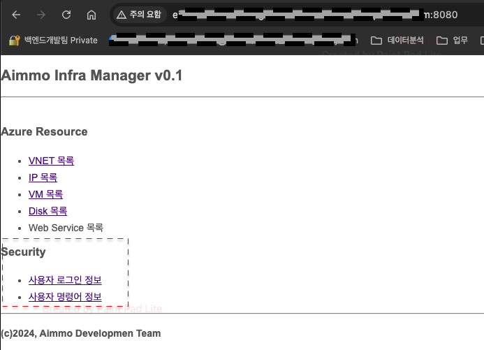
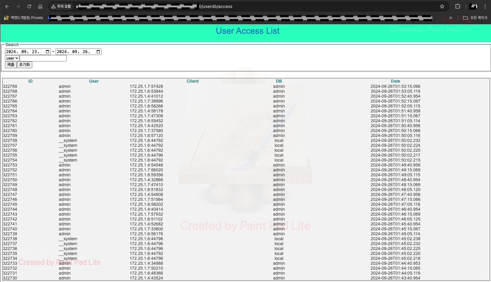
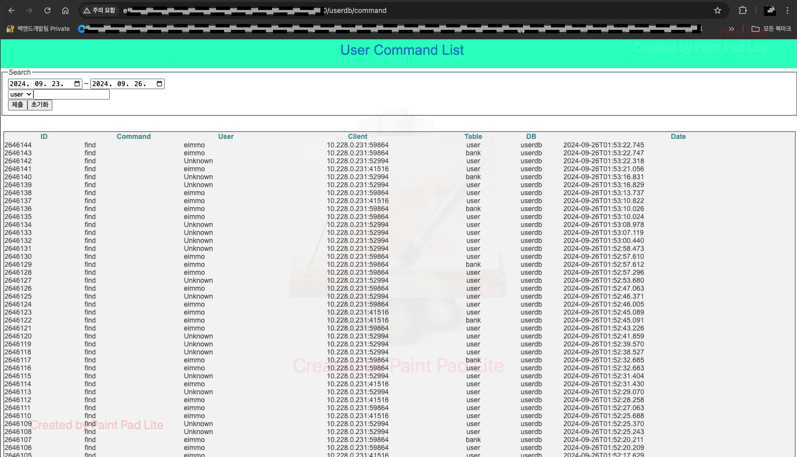

# log_collector
## 설명
이 프로그램은 몽고DB의 로그를 읽고 파싱하여 사용자 접근 정보와 명령어 정보를 DB에 저장하는 프로그램입니다.
## 프로그램 구조
구조는 다음과 같습니다.
```text
 기존
  로그 콜렉터 --> eimmo-infra-manager --> db
 변경
  로그 콜렉터 (로그 수집기 -> 레디스 -> 로그 파싱 프로세스 2개) -> db

```
변경 사유는 다음과 같습니다.
 - 1개의 로그-콜렉터가 실시간으로 로그를 처리하지 못함.
 - 1개의 로그를 처리하는데 1.5초 이상이 소요 됨.
 - 건수가 많을 경우에는 누락되거나 로그가 밀리게 됨.
 - 1개의 eimmo-infra-manager가 복수의 업무를 처리 하기에는 시스템 사양이 떨어 짐.
 - 클라이언트에서 바로 DB에 데이터를 넣고eimmo-infra-manager는 데이터를 조회용으로만 하는 것이 낳음.

## 설치 기본
배포는 수동 배포만 가능 합니다. DB를 설치 후에, 해당 코드를 받아서 아래의 항목을 수정하여 적용합니다.
 - config.py
 - log_collector_pub.service
 - log_collector_sub1.service
 - log_collector_sub2.service

코드는 "/opt" 위치에 아래와 같이 다운 받을 것을 권장 합니다.
```shell
git clone git@github.com:simpson-won/log_collector.git log_collector_v2
```

# 몽고 DB 사전 설정
이 프로그램은 몽고의 로그를 읽어서 파싱하여 저장하는 프로그램입니다.
따라서, 몽고DB의 로그에 사용자 접근 정보와 사용 정보가 있어야 합니다. 이를 위해서는 몽고DB의 로그 레벨이 2 이상이어야 합니다.
권장되는 레벨은 2입니다.
로그 레벨 설정은 아래와 같습니다.
```text
# 로그 레벨 설정 => 아래의 예는 레벨이 3으로 되어 있습니다.
rs0 [direct: secondary] admin> db.runCommand({setParameter:1, logLevel:3})
{
  was: 2,
  ok: 1,
  '$clusterTime': {
    clusterTime: Timestamp({ t: 1724896365, i: 1 }),
    signature: {
      hash: Binary.createFromBase64('dim9Hjt+1+fy8XnW0BWucjoxp24=', 0),
      keyId: Long('7376128859365703681')
    }
  },
  operationTime: Timestamp({ t: 1724896365, i: 1 })
}

# 설정된 로그 레벨 확인
rs0 [direct: secondary] admin> db.runCommand({getParameter:1, logLevel:1})
{
  logLevel: 3,
  ok: 1,
  '$clusterTime': {
    clusterTime: Timestamp({ t: 1724896365, i: 1 }),
    signature: {
      hash: Binary.createFromBase64('dim9Hjt+1+fy8XnW0BWucjoxp24=', 0),
      keyId: Long('7376128859365703681')
    }
  },
  operationTime: Timestamp({ t: 1724896365, i: 1 })
}
```

** 2 이상인 경우에는 필요없는 로그가 포함되어 로그 분실이나 지연이 발생할 수 있습니다.

# 서비스 설치

프로그램은 VENV와 서비스로 동작합니다. 따라서, venv 환경이 되어 있어야 하며, 프로그램 위치의 세 개의 service 파일을 서비스로 등록하여야 합니다.
또한, 프로그램에 redis가 설치 되어 있어야 합니다.

redis는 다음과 같이 설치 합니다.
```bash
apt install -y redis
systemctl enable redis
systemctl start redis
```

venv 환경은 다음과 같이 합니다.
```bash
cd /opt
git clone git@github.com:simpson-won/log_collector.git log_collector_v2
cd log_collector_v2
python -m venv venv
source venv/bin/activate
pip install -r requirement
```

서비스 설치는 다음과 같이 합니다.
```bash
cp /opt/log_collector_v2/log_collector_*.service /etc/systemd/system
systemctl enable log_collector_pub
systemctl enable log_collector_sub1
systemctl enable log_collector_sub2
systemctl start log_collector_pub
systemctl start log_collector_sub1
systemctl start log_collector_sub2
```

프로그램의 정지는 다음과 같이 하여 주십시요.
```bash
systemctl stop log_collector_pub
systemctl stop log_collector_sub1
systemctl stop log_collector_sub2
```

# 로그 로테이션
mongodb의 로그가 로테이션 되는 경우에 로그 읽는 부분에 에러가 발생합니다. 그래서 프로그램은 SIGUSR1을 받는 경우에 mongodb의 로그를 다시 읽도록 되어 있습니다.
따라서, mongodb의 로그가 로테이션 되는 시점에 log_collector_sub에도 SIGUSR1을 보내 주십시요.
이를 위해서 mongodb의 logrotation 파일에 아래와 같이 추가 하여 주십시요.
```text
  - sudo kill -s USR1 `cat /var/run/mongodb/*.pid`
  → sudo kill -s USR1 `cat /var/run/mongodb/*.pid`; sudo kill -s USR1 `cat /var/run/log_collector_v2_pub_1.pid`
```

아래는 몽고 DB에 적용된 예제 입니다.
```text
/var/log/mongodb/*.log, /data/log/*.log {
    su root root
    daily
    rotate 7
    missingok
    nocompress
    ifempty
    dateext
    sharedscripts
    postrotate
        sudo kill -s USR1 `cat /var/run/mongodb/*.pid`; sudo kill -s USR1 `cat /var/run/log_collector_v2_pub_1.pid`
    endscript
}
```

log_collector의 경우에도 log-rotation 관련 스크립트를 작성해야 합니다. 아래는 지금 현재 userdb에 적용된 스크립트 입니다.
```text
/opt/log_collector_v2/*.log
{
    daily
    rotate 7
    missingok
    compress
    notifempty
    dateext
}
```

# 로그 조회
로그 조회는 인프라 매니저에서 가능합니다.
주소는 다음과 같습니다.
<p>
 http://eimmo-infra-manager.koreacentral.cloudapp.azure.com:8080/
</p>
<p style="text-align: center;">

</p>
<p style="text-align: center;">

</p>
<p style="text-align: center;">

</p>